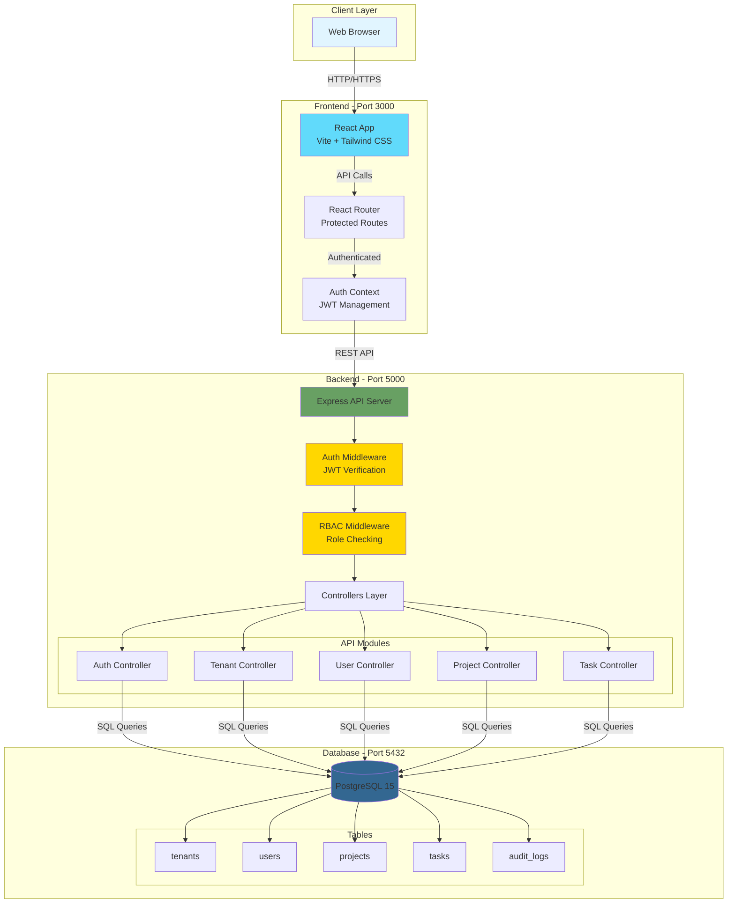
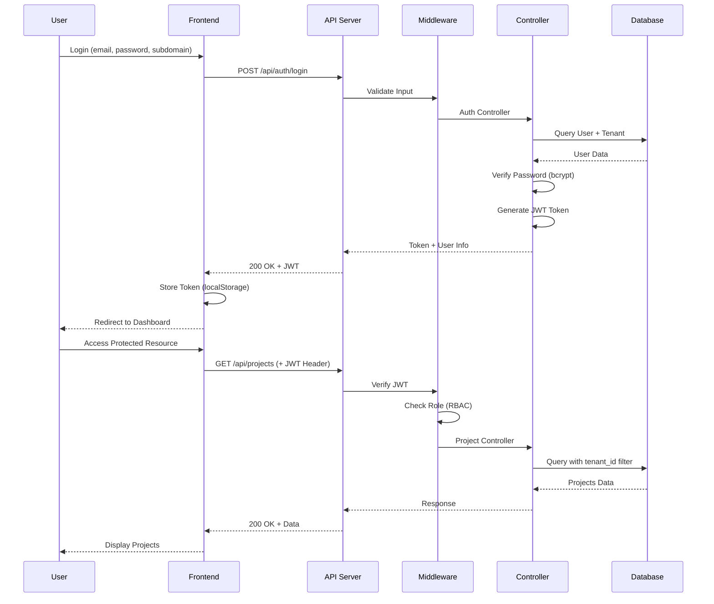
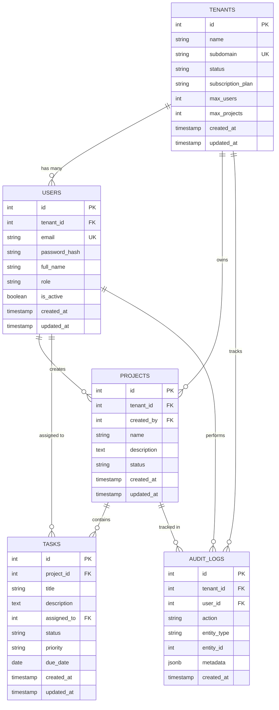
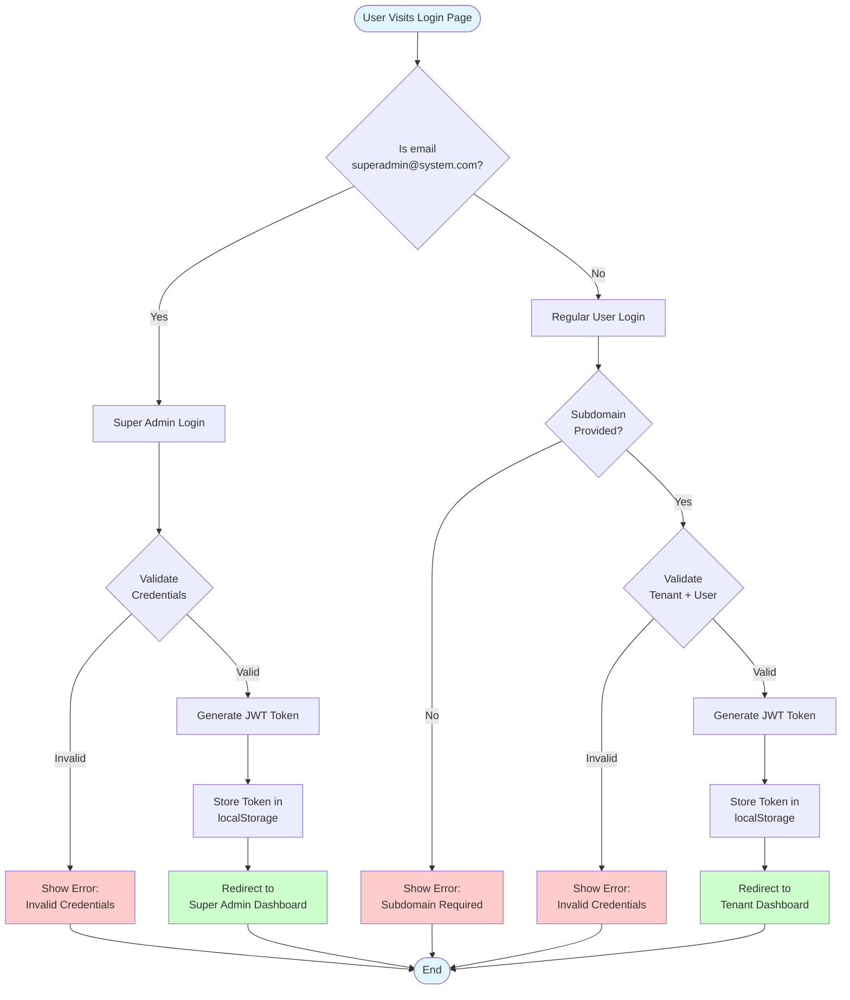

# 🚀 Multi-Tenant SaaS Platform

> Production-ready multi-tenant SaaS boilerplate with complete data isolation, role-based access control, subscription management, and modern UI

[](https://opensource.org/licenses/MIT)
[](https://nodejs.org/)
[](https://reactjs.org/)
[](https://www.postgresql.org/)

## 📋 Table of Contents

- [Overview](#overview)
- [Features](#features)
- [Tech Stack](#tech-stack)
- [Architecture](#architecture)
- [Database Schema](#database-schema)
- [Quick Start](#quick-start)
- [API Documentation](#api-documentation)
- [Authentication](#authentication)
- [Testing](#testing)
- [Project Structure](#project-structure)

## 🎯 Overview

A complete multi-tenant SaaS platform featuring tenant isolation, role-based access control, subscription management, and a modern React frontend. Perfect for building B2B SaaS applications with multiple organizations.

### Key Highlights

- ✅ **Complete Tenant Isolation** - Data segregation at database level
- ✅ **Modern UI** - Premium light theme with gradients and animations
- ✅ **RBAC** - Super Admin, Tenant Admin, and User roles
- ✅ **Subscription Plans** - Free, Pro, and Enterprise tiers with limits
- ✅ **REST APIs** - 19 endpoints for complete CRUD operations
- ✅ **Docker Ready** - One-command deployment
- ✅ **Audit Logging** - Track all user actions
- ✅ **JWT Authentication** - Secure token-based auth

## ✨ Features

### Multi-Tenancy
- Tenant-based data isolation using `tenant_id`
- Subdomain-aware authentication
- Per-tenant subscription limits
- Automatic tenant context in all queries

### Role-Based Access Control (RBAC)
- **Super Admin**: System-wide access, can manage all tenants
- **Tenant Admin**: Full access within their tenant
- **User**: Limited access to assigned projects and tasks

### Authentication & Security
- JWT tokens with 24-hour expiration
- Bcrypt password hashing (10 rounds)
- Subdomain validation for regular users
- Super admin bypass for subdomain requirement
- Protected routes with role-based UI rendering

### Subscription Management
- **Free Plan**: 5 users, 3 projects
- **Pro Plan**: 25 users, 15 projects
- **Enterprise Plan**: 100 users, 50 projects
- Automatic limit enforcement at API level

### Audit Logging
- Track all CRUD operations
- User authentication events
- Tenant-specific audit trails
- Metadata capture (IP, user agent)

## 🛠️ Tech Stack

### Backend
```
Node.js 18+
├── Express.js - Web framework
├── PostgreSQL - Database
├── pg - PostgreSQL client
├── jsonwebtoken - JWT authentication
├── bcrypt - Password hashing
├── express-validator - Input validation
├── helmet - Security headers
├── cors - Cross-origin resource sharing
└── morgan - HTTP request logger
```

### Frontend
```
React 18.2
├── Vite - Build tool
├── React Router DOM 6.28 - Routing
├── Axios 1.7.7 - HTTP client
├── Tailwind CSS 3.4 - Styling
├── PostCSS - CSS processing
└── Autoprefixer - CSS vendor prefixes
```

### DevOps
```
Docker & Docker Compose
├── PostgreSQL 15 container
├── Backend container (Node.js)
└── Frontend container (Nginx)
```

## 🏗️ Architecture

### System Architecture



### Request Flow



## 🗄️ Database Schema

### Entity Relationship Diagram



### Table Descriptions

| Table | Purpose | Key Features |
|-------|---------|--------------|
| `tenants` | Store tenant/organization data | Subdomain uniqueness, subscription plans, limits |
| `users` | User accounts with tenant association | Role-based access, bcrypt passwords, tenant_id FK |
| `projects` | Tenant-scoped projects | Created by users, status tracking |
| `tasks` | Project tasks with assignments | Priority levels, due dates, user assignments |
| `audit_logs` | Activity tracking | JSON metadata, tenant/user context |

## 🚀 Quick Start

### Prerequisites

- Docker Desktop installed and running
- Git installed
- Ports 3000, 5000, and 5432 available

### Installation

1. **Clone the repository**
```bash
git clone https://github.com/shahanth4444/multi-tenant-saas.git
cd multi-tenant-saas
```

2. **Start with Docker Compose**
```bash
docker-compose up -d --build
```

3. **Verify the services**
```bash
# Check health endpoint
curl http://localhost:5000/api/health

# Expected response:
# {"status":"ok","database":"connected"}
```

4. **Access the application**
- Frontend: http://localhost:3000
- Backend API: http://localhost:5000/api
- Database: localhost:5432

### Default Credentials

#### Super Admin (No Subdomain Required)
```
Email: superadmin@system.com
Password: Admin@123
Subdomain: (leave empty)
```

#### Demo Tenant Admin
```
Email: admin@demo.com
Password: Demo@123
Subdomain: demo
```

#### Demo Tenant Users
```
Email: user1@demo.com
Password: User@123
Subdomain: demo

Email: user2@demo.com
Password: User@123
Subdomain: demo
```

## 📡 API Documentation

### Base URL
```
http://localhost:5000/api
```

### Authentication Endpoints

| Method | Endpoint | Description | Auth Required |
|--------|----------|-------------|---------------|
| POST | `/auth/register` | Register new tenant | No |
| POST | `/auth/login` | User login | No |
| GET | `/auth/me` | Get current user | Yes |
| POST | `/auth/logout` | Logout user | Yes |

### Tenant Endpoints

| Method | Endpoint | Description | Role Required |
|--------|----------|-------------|---------------|
| GET | `/tenants` | List all tenants | super_admin |
| GET | `/tenants/:id` | Get tenant details | super_admin |
| PUT | `/tenants/:id` | Update tenant | super_admin |
| DELETE | `/tenants/:id` | Delete tenant | super_admin |

### User Endpoints

| Method | Endpoint | Description | Role Required |
|--------|----------|-------------|---------------|
| GET | `/users` | List tenant users | tenant_admin |
| POST | `/users` | Create user | tenant_admin |
| GET | `/users/:id` | Get user details | tenant_admin |
| PUT | `/users/:id` | Update user | tenant_admin |
| DELETE | `/users/:id` | Delete user | tenant_admin |

### Project Endpoints

| Method | Endpoint | Description | Role Required |
|--------|----------|-------------|---------------|
| GET | `/projects` | List projects | user |
| POST | `/projects` | Create project | tenant_admin |
| GET | `/projects/:id` | Get project details | user |
| PUT | `/projects/:id` | Update project | tenant_admin |
| DELETE | `/projects/:id` | Delete project | tenant_admin |

### Task Endpoints

| Method | Endpoint | Description | Role Required |
|--------|----------|-------------|---------------|
| GET | `/projects/:projectId/tasks` | List tasks | user |
| POST | `/projects/:projectId/tasks` | Create task | user |
| GET | `/tasks/:id` | Get task details | user |
| PUT | `/tasks/:id` | Update task | user |
| DELETE | `/tasks/:id` | Delete task | user |

### Response Format

All API responses follow this structure:

```json
{
  "success": true,
  "message": "Operation successful",
  "data": {
    // Response data
  }
}
```

Error responses:
```json
{
  "success": false,
  "message": "Error description"
}
```

## 🔐 Authentication

### JWT Token Structure

```javascript
{
  userId: number,
  tenantId: number | null,
  role: 'super_admin' | 'tenant_admin' | 'user',
  iat: number,
  exp: number
}
```

### Using JWT in Requests

Include the token in the Authorization header:

```bash
curl -H "Authorization: Bearer YOUR_JWT_TOKEN" \
  http://localhost:5000/api/users
```

### Login Flow



## 🧪 Testing

### Test All Login Scenarios

1. **Super Admin (No Subdomain)**
```
✅ Email: superadmin@system.com
✅ Password: Admin@123
✅ Subdomain: (empty)
✅ Expected: Login Success → Super Admin Dashboard
```

2. **Regular User (No Subdomain - Should Fail)**
```
❌ Email: admin@demo.com
❌ Password: Demo@123
❌ Subdomain: (empty)
❌ Expected: Error "Company Subdomain is required"
```

3. **Regular User (With Subdomain - Should Succeed)**
```
✅ Email: admin@demo.com
✅ Password: Demo@123
✅ Subdomain: demo
✅ Expected: Login Success → Tenant Dashboard
```

### Health Check

```bash
curl http://localhost:5000/api/health
```

Expected response:
```json
{
  "status": "ok",
  "database": "connected"
}
```

## 📁 Project Structure

```
multi-tenant-saas/
├── backend/
│   ├── src/
│   │   ├── config.js              # Configuration
│   │   ├── db.js                  # Database connection
│   │   ├── init.js                # Database initialization
│   │   ├── server.js              # Express server
│   │   ├── controllers/           # API controllers
│   │   │   ├── auth.controller.js
│   │   │   ├── tenant.controller.js
│   │   │   ├── user.controller.js
│   │   │   ├── project.controller.js
│   │   │   └── task.controller.js
│   │   ├── middleware/            # Express middleware
│   │   │   └── auth.js
│   │   ├── routes/                # API routes
│   │   │   ├── auth.routes.js
│   │   │   ├── tenant.routes.js
│   │   │   ├── user.routes.js
│   │   │   ├── project.routes.js
│   │   │   └── task.routes.js
│   │   └── utils/                 # Utility functions
│   │       ├── audit.js
│   │       └── responses.js
│   ├── .env                       # Environment variables
│   ├── Dockerfile
│   └── package.json
│
├── frontend/
│   ├── src/
│   │   ├── api.js                 # Axios configuration
│   │   ├── auth.js                # Auth utilities
│   │   ├── main.jsx               # React entry point
│   │   ├── App.jsx                # Main app component
│   │   ├── index.css              # Global styles
│   │   ├── components/            # React components
│   │   │   ├── Navbar.jsx
│   │   │   └── ProtectedRoute.jsx
│   │   └── pages/                 # Page components
│   │       ├── Login.jsx
│   │       ├── Register.jsx
│   │       ├── Dashboard.jsx
│   │       ├── Users.jsx
│   │       ├── Projects.jsx
│   │       └── ProjectDetails.jsx
│   ├── index.html
│   ├── vite.config.js
│   ├── tailwind.config.js
│   ├── Dockerfile
│   └── package.json
│
├── docker-compose.yml             # Docker Compose configuration
├── submission.json                # Test credentials
└── README.md                      # This file
```

## 🌟 Key Features Explained

### Tenant Isolation

All database queries automatically include tenant context:

```javascript
// Example: Fetching projects for current tenant
const { rows } = await query(
  'SELECT * FROM projects WHERE tenant_id = $1',
  [req.user.tenantId]
);
```

### Subscription Limits

Automatic enforcement before creation:

```javascript
// Check user limit before creating new user
const userCount = await query(
  'SELECT COUNT(*) FROM users WHERE tenant_id = $1',
  [tenantId]
);

if (userCount >= tenant.max_users) {
  return forbidden(res, 'User limit reached for your plan');
}
```

### Role-Based UI

Frontend components adapt based on user role:

```jsx
{user.role === 'tenant_admin' && (
  <button onClick={createProject}>Create Project</button>
)}
```

## 🔧 Environment Variables

### Backend (.env)

```env
DB_HOST=database
DB_PORT=5432
DB_NAME=saas_db
DB_USER=postgres
DB_PASSWORD=postgres
JWT_SECRET=supersecret_jwt_key_that_is_at_least_32_chars!
JWT_EXPIRES_IN=24h
PORT=5000
FRONTEND_URL=http://frontend:3000
```

## 📝 License

This project is licensed under the MIT License.

## 👤 Author

**Shahanth**
- GitHub: [@shahanth4444](https://github.com/shahanth4444)
- Email: shahanthkarri@gmail.com

## 🙏 Acknowledgments

- Built with modern web technologies
- Inspired by enterprise SaaS architectures
- Designed for scalability and maintainability

---

**Made with ❤️ for the SaaS community**
