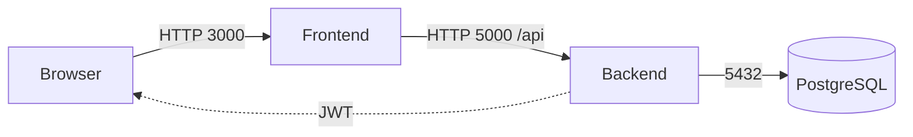
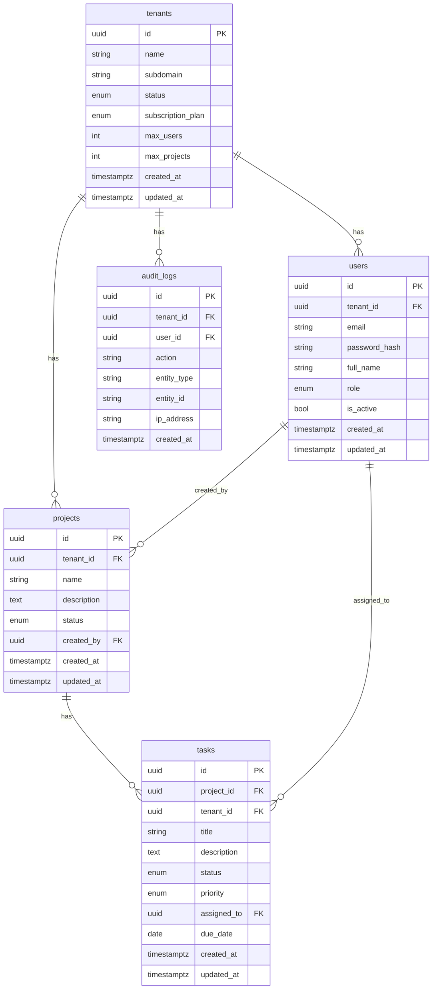

# Architecture

## System Architecture Diagram
- Browser (React SPA) → Backend (Express API) → PostgreSQL (database)
- JWT Auth flow: Login issues token; subsequent requests include Authorization: Bearer <token>
- CORS allows origin FRONTEND_URL; services communicate via Docker service names

A Mermaid diagram is included below; export to PNG for final docs:

## Database ERD

## API Architecture
- Auth: POST /api/auth/register-tenant, POST /api/auth/login, GET /api/auth/me, POST /api/auth/logout
- Tenants: GET /api/tenants/:tenantId, PUT /api/tenants/:tenantId, GET /api/tenants (super_admin)
- Users: POST /api/tenants/:tenantId/users, GET /api/tenants/:tenantId/users, PUT /api/users/:userId, DELETE /api/users/:userId
- Projects: POST /api/projects, GET /api/projects, PUT /api/projects/:projectId, DELETE /api/projects/:projectId
- Tasks: POST /api/projects/:projectId/tasks, GET /api/projects/:projectId/tasks, PATCH /api/tasks/:taskId/status, PUT /api/tasks/:taskId

Auth requirements and roles are enforced per endpoint as specified.
